# 2.0 Administration Menu

I.	Administration area
1.	Customers
2.	Vehicles
3.	Suppliers
4.	Categories of spare parts
5.	Spare parts
6.	Package
7.	Brands
8.	Workers
9.	Documentation
10.	Trash
11.	Repair task
12.	Editions
13.	Preferences of the module
II.	User area  
 
**2.	ADMINISTRATION**

**2.1 	New GUI Interface look **

As explained by Mamba here, Mage has created a new class for Module Administration GUI which provides a fresh and attractive admin interface, auto generated from data in the menu.php.

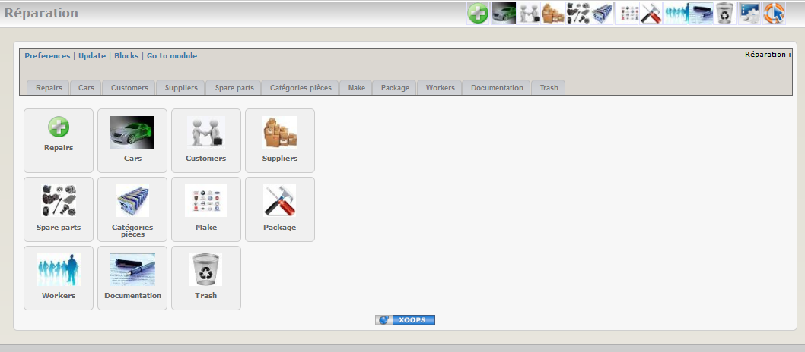
*Figure 1: Main view of the Repair-Shop Module (Admin side)*
 
 
 
**2.2 	Customers**

You can save all customer information in the database. It’s of course useful for regular customers.
List of customer records :

 
Form for adding a new customer:
 
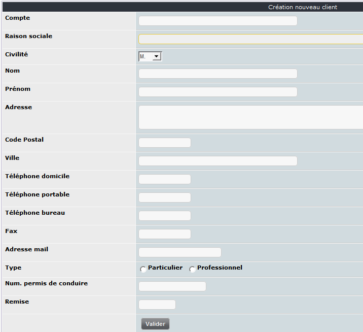

 
**2.3 	Cars**

This tab is dedicated to car maintenance management in the garage. 

List of registered cars:
 
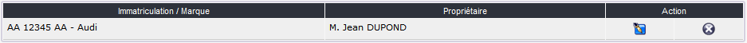

Form to add a new car:
 
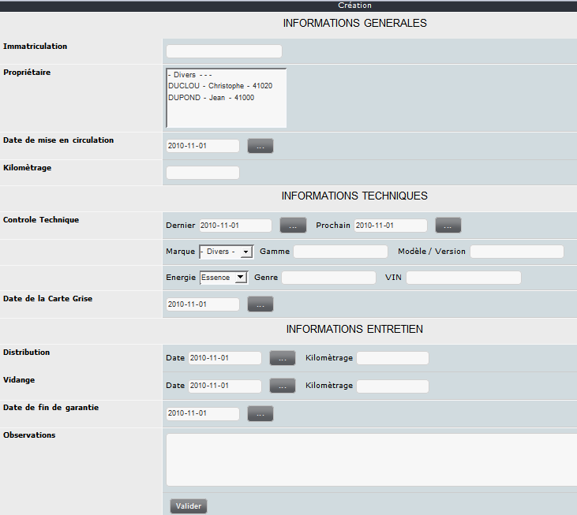 

**2.4 	Suppliers**

Registered supplier list:

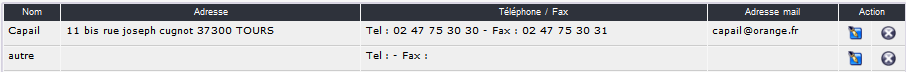 

Form to add a new supplier:

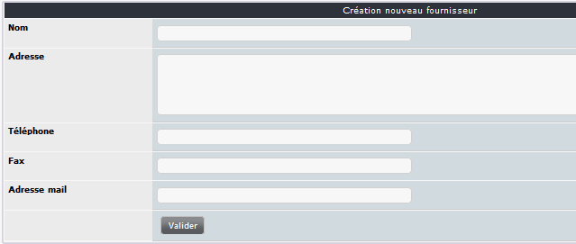 
 
**2.5 	Spare parts**

As it’s possible to have many spare parts in the full list a small tab is available to show / hide the spare parts list.

Spare parts list:

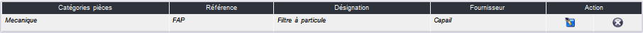 

Form to add a new spare part :

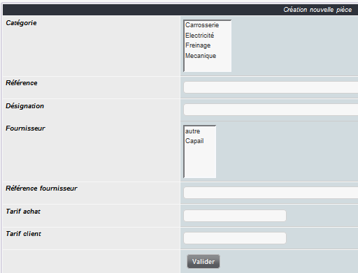 

 
**2.6 	Spare parts categories**

Using categories allows sorting of the spare parts.

Category list:

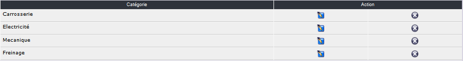 

Form to add a new category:

 
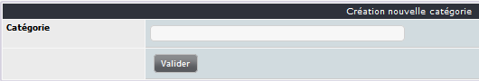
 
**2.7 	Brands**

Few brands are already included when you install the module. You can of course add other brands.

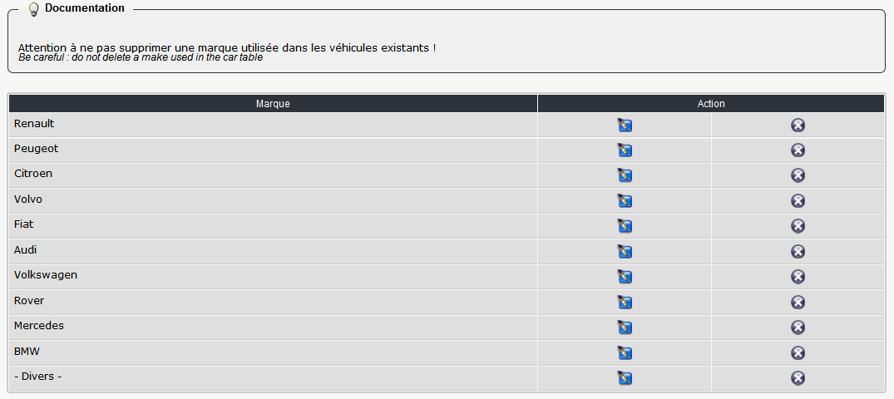
 
Form to add a new brand:
 
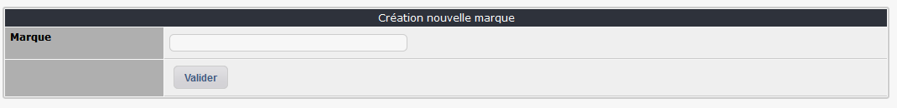
 
**2.8 	Package**

Package list:

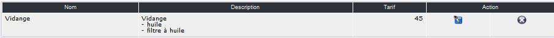 

Form to add a new package:

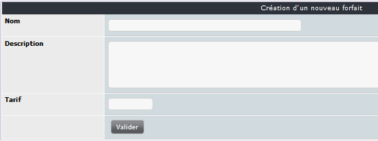 

When you have submitted the first form a new one is shown which allows adding spare parts.

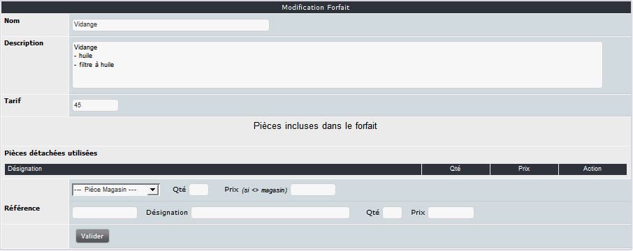 

 
**2.9 	Workers**

List of available workers:

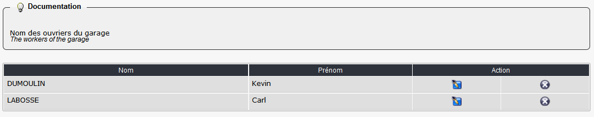 
 
Form to add a new worker:

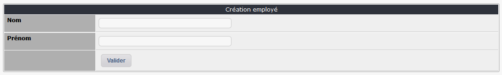  

**2.10 	Documentation**

An integrated documentation system is available. It helps the administrator of the module by showing specific tips in each admin tabs.
You can of course update these tips by adding your own info. It can be useful when you use some tabs rarely and need a quick reminder about the functionality or if you delegate the admin of the module to a non-expert user.
 
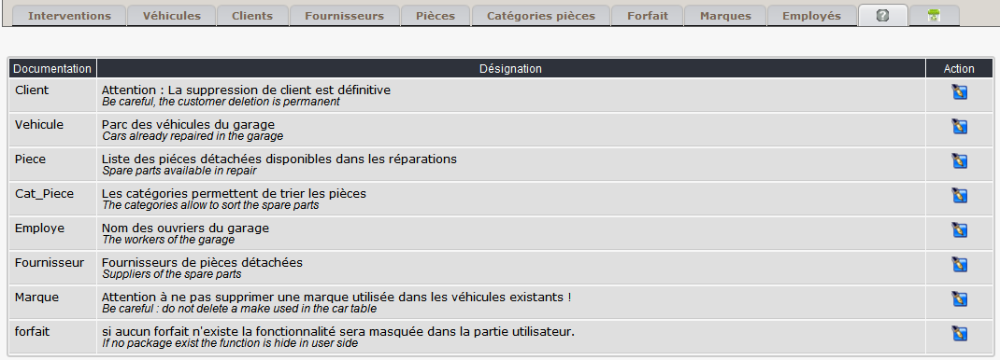  

 
**2.11 	Trash**

A trash system is available to undelete a repair deleted by mistake ;-).
 
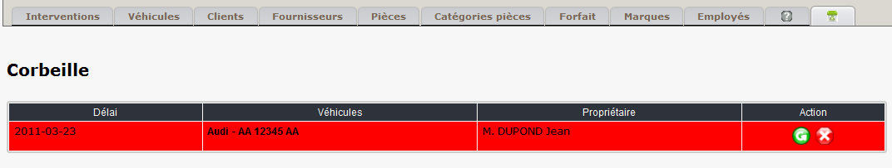  