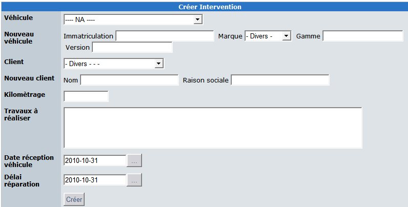
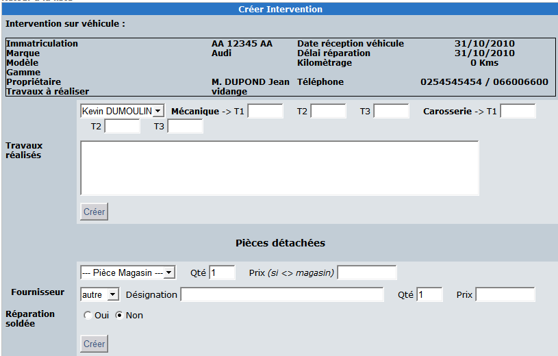
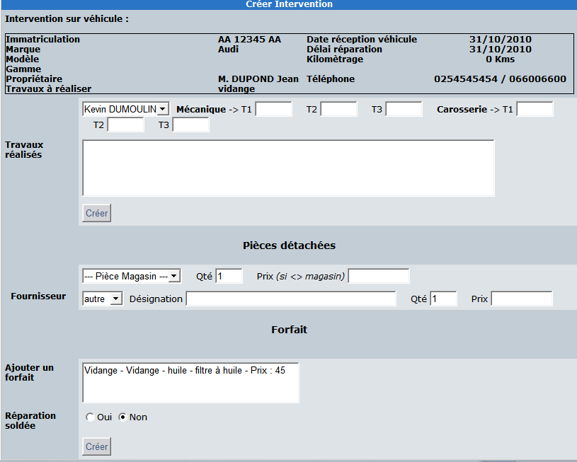
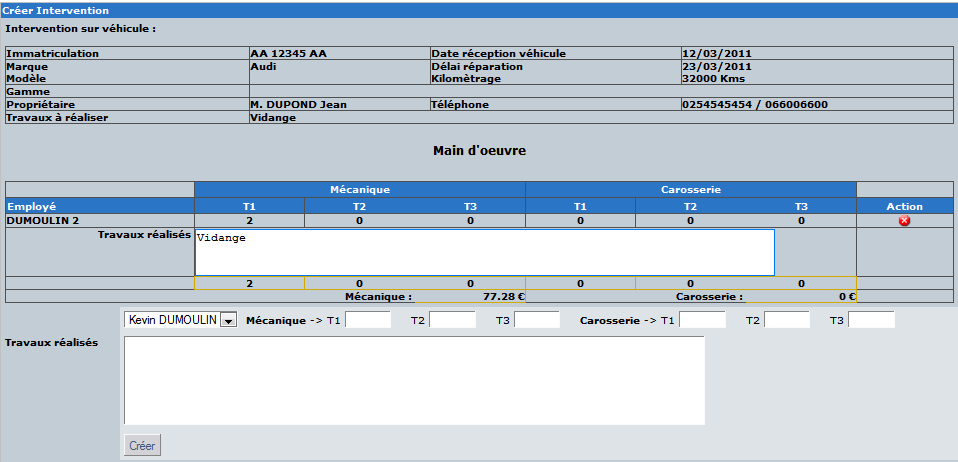

# 4.0 Operating Instructions

3.	REPAIR TASK

**3.1 	Logical process**

You can add a new repair task both in admin area and in user side.

   

**Main data:**

The list of vehicles managed in the module is available in the first dropdown list. 
You can, of course, add a new vehicle or a new customer directly in this form. 

**Useful data:**

Kilometers/Miles and repair task to do are required to create a new repair task.
The arrival date and the due date are used to set priorities in the garage work.

Repair details are shown as follow in the user side:

   

If at least one package is created by the admin, a specific form is shown at the bottom of the screen:
 
   

If an admin edits a repair task in the user side, he can manage more data than a standard user.
For example, he can add / delete some task:
 
   
 
 

**3.2 	Printing**

The module can print quotation and invoices.
Some data as garage name can be managed in the preferences of the module.
Quote
 
  

**3.3 	Invoice**
 
 