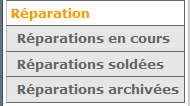
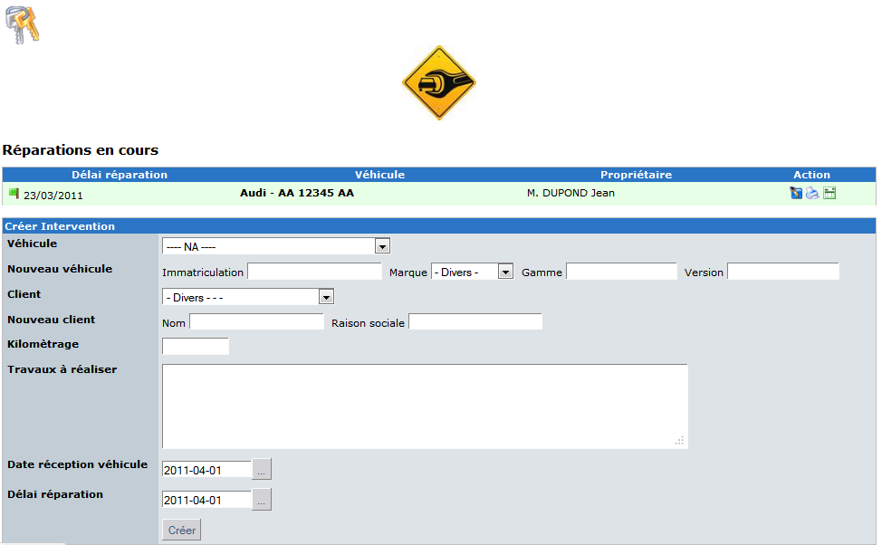
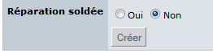
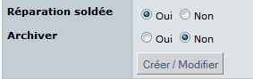
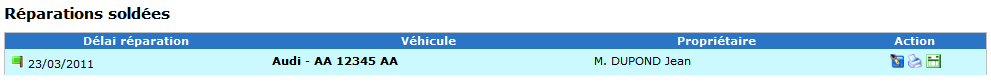

# 5.0 The User Side

In the main menu you can choose a repair task sorted by status.
There are 3 possible status choices:

* **In progress**: the repair is created and not yet ended or not started. Of course it’s possible that you are just waiting the acceptation of the quote. 

* **Ended**: the repair is terminated and the vehicle is given to the customer. The quote and the invoice have been printed.
 
* **Archived**: it’s necessary to store the history of the repair task so we keep the data in this area. I assume it’s a temporary solution and I’m working on this point for the next version of the module.

You can access to the repair in each state thru the main menu: 

 
 
In the “repair in progress” it’s possible to create a new repair task, update a repair, print a quote or issue an invoice.
If you have admin right, you can access the Admin area with a click on the key picture at the left top.

 

When all task are done for a particular repair, you can “close“ the repair by using a checkbox at the bottom of the modification form. (depending on how you set module preferences. 

As default, it is only available for the Admin, however, if desired, you can allow it also to the users by changing the module preferences).

  

When the repair is closed, you can archive it to keep its history for future inquiries.
 
   

You can see repairs for each status. Each status has a specific color, thus preventing misunderstandings. 

  
 

> **NOTE:** you always can print quote or invoice. 