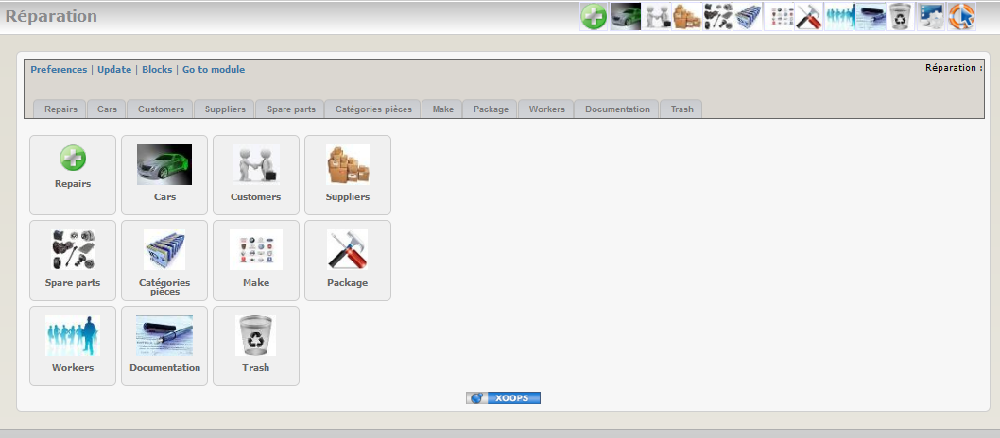

### _XOOPS Documentation Series_

# Module Gestion des réparations
#### for XOOPS 2.5.7
      

            
## User Manual

© 2016 XOOPS Project ([www.xoops.org](http://xoops.org))   

## Module Purpose 

Ce module a été développé pour une utilisation dans un garage automobile.Il pourrait bien entendu être adapté pour gérer une activité du genre service après vente.

Il a été développé sur un XOOPS 2.4 et les tests sur un XOOPS 2.5 sont concluants.

Le besoin exprimé était d’avoir à disposition un outil de suivi des réparations dans un garage automobile. Deux secteurs différents, mécanique et carrosserie ; plusieurs ouvriers dans chaque secteur.

Le module permet de gérer le parc de voitures en entretien dans le garage, de suivre les interventions en cours et terminées, d’éditer des devis et des factures.

*Figure 1: Main view of the Repair-Shop Module (Admin side)*

## Download/Fork the Module  

**You can fork the module --> [here](https://github.com/XoopsModules25x/repair))** 

## How to Contribute

[You can contribute on GitHub](https://github.com/XoopsDocs/repair-tutorial). Changes will be [pushed to Gitbook.io automatically](https://www.gitbook.com/book/xoops/repair-tutorial/activity) when the [main repository](https://github.com/XoopsDocs/repair-tutorial) changes.

Editing the book can be done either by updating the markdown files with a text editor, or opening the repository in [the Gitbook desktop app](https://github.com/GitbookIO/editor/blob/master/README.md). The desktop app will give you a live preview option.

# Table of Content

* [Install/Uninstall](book/1install.md)
* [Administration Menu](book/2administration.md)
* [Preferences](book/3preferences.md)
* [Operating Instructions](book/4operations.md)
* [The User Side](book/5userside.md)
* [Blocks](book/6blocks.md)
* [Templates](book/7templates.md)
* [Miscellaneous](book/8other.md) 
* [Module Credits](book/9credits.md)
* [About XOOPS CMS](book/10aboutxoops.md)

##License:

 Unless specified, this content is licensed under a <a rel="license" href="http://creativecommons.org/licenses/by-nc-sa/4.0/">Creative Commons Attribution-NonCommercial-ShareAlike 4.0 International License</a>.

All derivative works are to be attributed to XOOPS Project ([www.xoops.org](http://xoops.org))
