# 2.0 Descriptif détaillé 

I.	Face administration 
1. Clients
2. Véhicules
3. Fournisseurs
4. Catégories de pièces
5. Pièces
6. Forfait
7. Marques
8. Employés
9. Documentation
10. Corbeille
11. Interventions
12. Editions
13. Préférences du module

**II.	User area ** 
 
**2.	ADMINISTRATION**

**2.1 	New GUI Interface look **

As explained by Mamba here, Mage has created a new class for Module Administration GUI which provides a fresh and attractive admin interface, auto generated from data in the menu.php.

 
 
 
**2.2 	Clients**

La tenue du fichier client permet de conserver les coordonnées des différents clients. Liste des clients enregistrés :

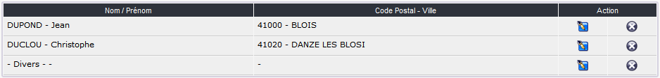
 
Form for adding a new customer:
 
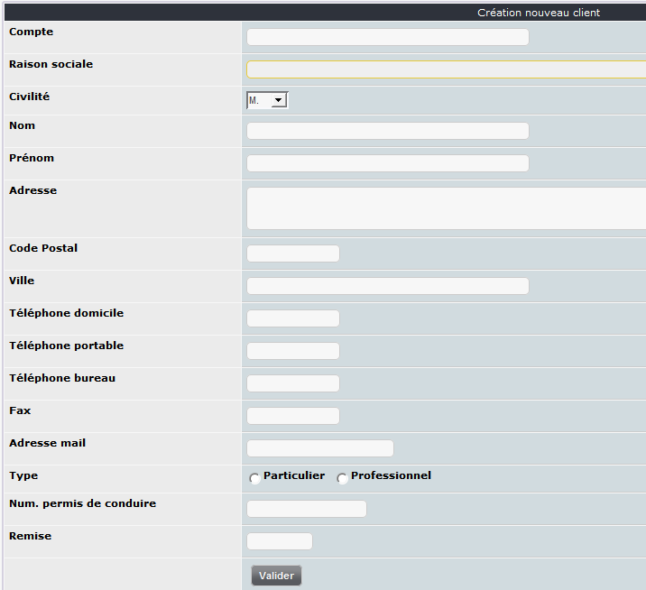

 
**2.3 	Véhicules**

Cet onglet est dédié à la gestion du parc de véhicules en entretien dans le garage. 

Liste des véhicules enregistrés :

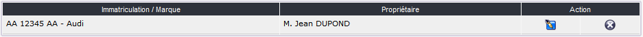

Interface de création d’un nouveau véhicule :
 
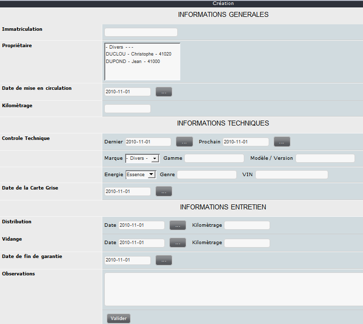 

**2.4 	. Fournisseurs**

Liste des fournisseurs référencés :

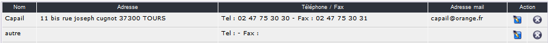 

Interface de création d’un nouveau fournisseur :

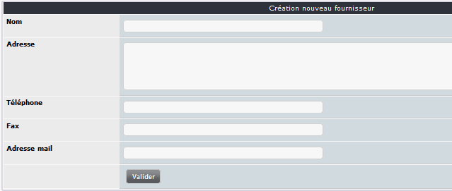 
 
**2.5 Catégories de pièces**

L’utilisation des catégories permet de trier la liste des pièces détachées. 

Liste des catégories :

 

Interface de création d’une catégorie :

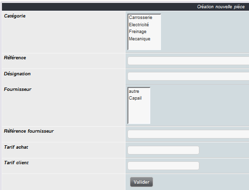 

 
**2.6 	Pièces**

La liste des pièces pouvant devenir conséquente un clic sur va permettre

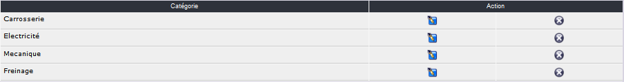 

Interface de création d’une nouvelle pièce :

 
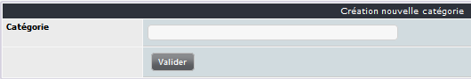
 
**2.7 	Marques**

Un certain nombre de marques courantes sont déjà renseignées à l’installation du module.

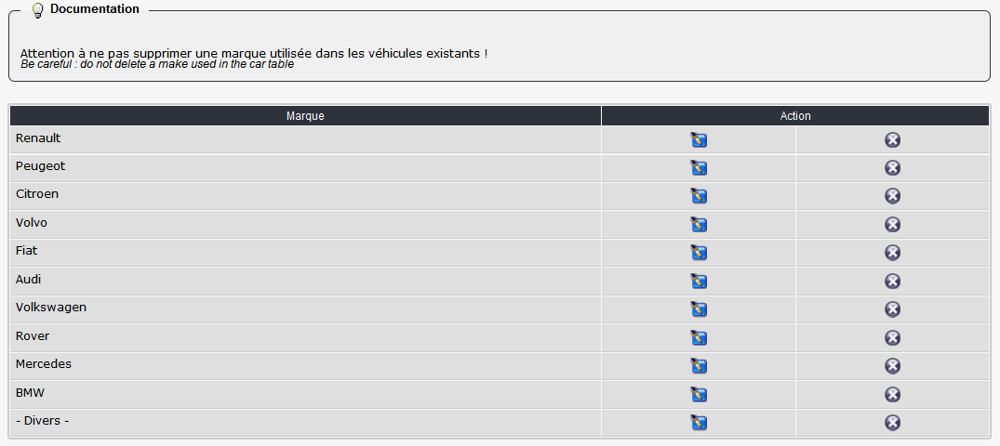
 
Création d’une nouvelle marque :
 
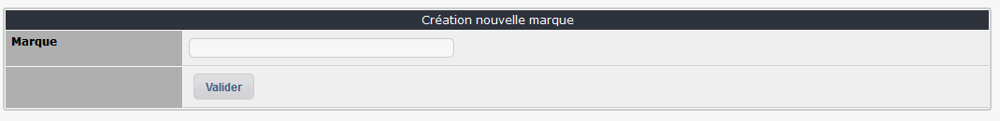
 
**2.8 	Package**

Package list:

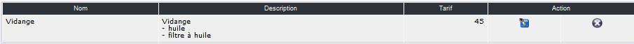 

Form to add a new package:

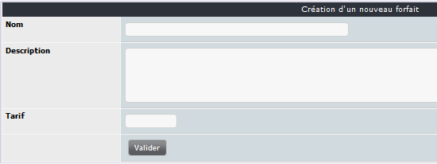 

When you have submitted the first form a new one is shown which allows adding spare parts.

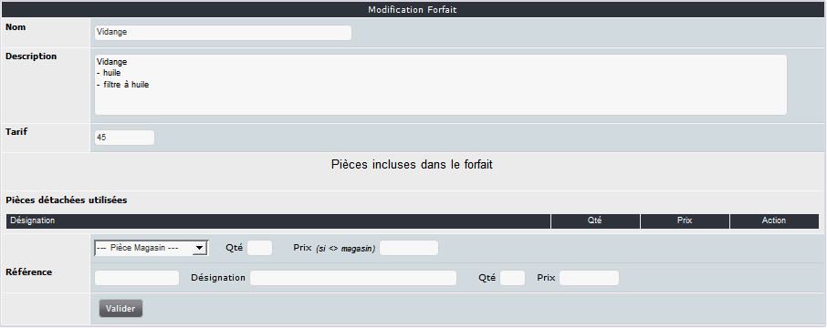 

 
**2.9 	Employés**

List of available workers:

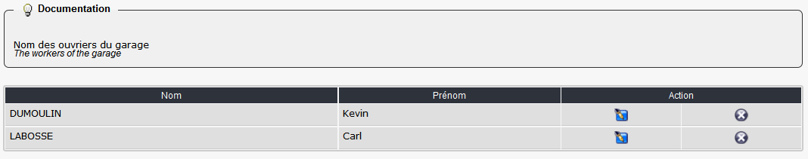 
 
Création d’un nouvel employé :

  

**2.10 	Documentation**

Un système de documentation intégré permet d’aider le gestionnaire en affichant une aide spécifique à chaque onglet de l’administration du module.

La modification de ces informations permet d’avoir à disposition un ‘pense bête’ pour des fonctionnalités utilisées moins fréquemment.
 
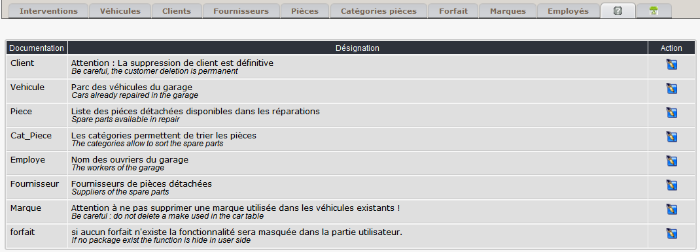  

 
**2.11 	Corbeille**

Un système de corbeille est mis en place pour récupérer une intervention qui aurait été supprimée par erreur. ;-).
 
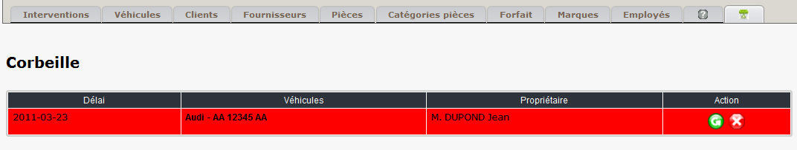  