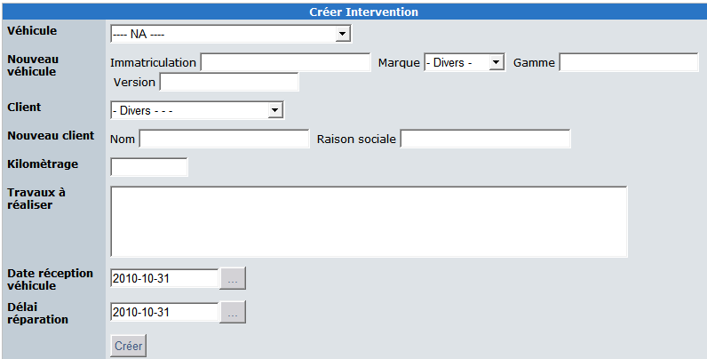
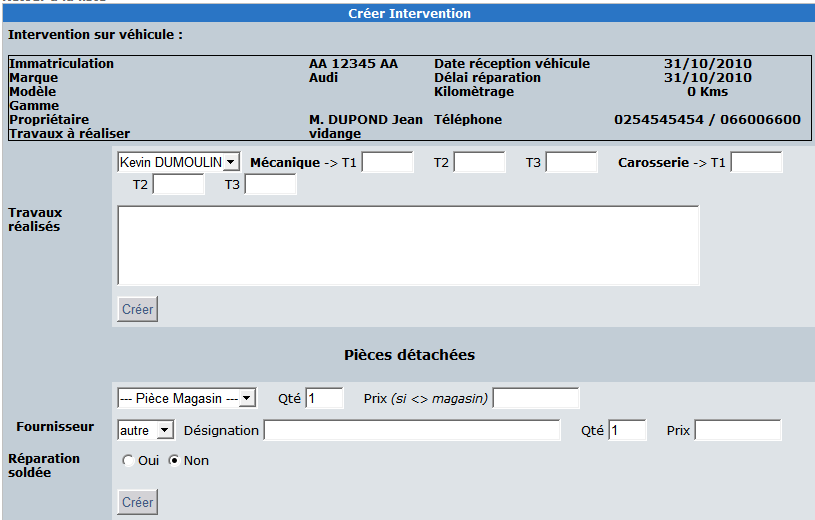
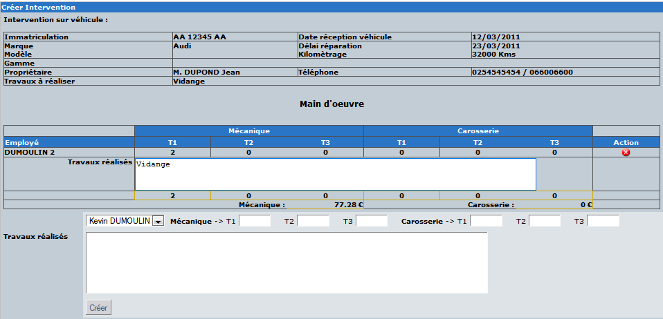
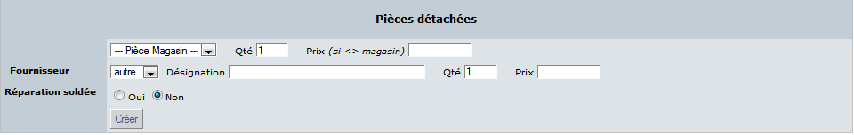

# 4.0 Operating Instructions

3.	REPAIR TASK

**3.1 	Logique de traitement**

La création d’une nouvelle réparation se fait soit dans la zone utilisateur soit dans la zone administration.

   

**Information générales :**

La liste des véhicules du parc ainsi que leur propriétaire est disponible dans la première liste déroulante.

La création d’un nouveau véhicule ou même d’un nouveau client est bien sur possible directement à cet endroit.

**Informations pratiques :**

Le kilométrage, la liste des travaux à réaliser sont des informations nécessaires à la création de la fiche d’intervention.

Les dates de réception et le délai de restitution du véhicule permettent de gérer les urgences dans la charge du garage. Le détail de la réparation se présente de la manière suivante coté utilisateur :

   

Si au moins un forfait a été créé via l’administration du module la zone spécifique aux forfaits s’affiche :
 
   

If an admin edits a repair task in the user side, he can manage more data than a standard user.
For example, he can add / delete some task:
 
   
 
 

**3.2 	Printing**

The module can print quotation and invoices.
Some data as garage name can be managed in the preferences of the module.
Quote
 
  

**3.3 	Invoice**
 
 